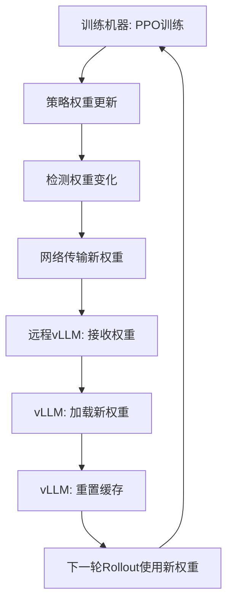

# PPO远程Rollout部署指南

## **关于PPO中策略模型权重更新机制**

### **⚠️ 重要：基线模型 vs 动态权重**

很多用户可能会疑惑：为什么vLLM服务器启动时使用的是基线模型地址，但PPO训练需要不断更新权重？

**答案**：这是一个**两阶段过程**：

#### **阶段1：初始化（使用基线模型）**
```bash
MODEL_NAME="LLM-Research/Meta-Llama-3.1-8B-Instruct"  # 基线模型
swift rollout --model $MODEL_NAME  # vLLM服务器启动时加载基线权重
```

#### **阶段2：动态权重同步（训练过程中）**
```
PPO训练步骤：
1. 策略网络前向传播 → 生成动作
2. 收集奖励和优势估计
3. 策略梯度更新 → 策略权重改变
4. 自动同步新权重到vLLM服务器  ← 关键步骤！
5. 下一轮rollout使用更新后的权重
```

### **权重同步的具体实现**

ms-swift通过以下机制确保权重实时同步：

1. **自动检测权重变化**：每次PPO epoch完成后
2. **网络传输**：通过 `vllm_client.update_named_param()` 方法
3. **批量更新**：支持DeepSpeed ZeRO-3的参数收集
4. **缓存重置**：更新后重置前缀缓存确保一致性

### **权重更新时机**
在PPO强化学习训练中，策略模型权重的更新遵循以下机制：

1. **Batch内固定权重**：在同一个rollout batch内，策略模型权重保持固定
   - 这确保了策略梯度估计的一致性
   - 避免了在rollout过程中权重变化导致的不稳定性

2. **Epoch间动态更新**：每个PPO epoch完成后，策略模型权重会更新
   - 策略网络参数通过PPO损失函数优化
   - 价值网络参数通过价值函数损失优化
   - 更新后的权重会同步到rollout引擎

3. **权重同步机制**：
   ```bash
   --sync_ref_model true              # 启用参考模型同步
   --ref_model_sync_steps 50          # 每50步同步一次（更频繁）
   --ref_model_mixup_alpha 0.8        # 权重混合系数（更激进的更新）
   ```

### **远程Rollout的权重同步流程**



**关键特点**：
- **初始基线**：vLLM启动时使用MODEL_NAME指定的基线模型
- **动态更新**：训练过程中权重通过网络实时同步
- **透明同步**：用户无需手动操作，ms-swift自动处理权重传输
- **性能优化**：支持批量更新和压缩传输

## **部署步骤**

### **1. 环境准备**

确保两台机器都安装了ms-swift和相关依赖：
```bash
# 安装ms-swift
pip install ms-swift[llm] -U

# 安装vLLM (在远程rollout机器上)
pip install vllm -U
```

### **2. 网络配置**

确保两台机器之间网络连通：
```bash
# 在训练机器上测试连接
telnet REMOTE_VLLM_HOST 8000

# 确保防火墙开放端口
sudo ufw allow 8000
```

### **3. 部署流程**

#### **Step 1: 启动远程vLLM服务器**
在远程rollout机器上运行：
```bash
chmod +x start_remote_vllm_server.sh
./start_remote_vllm_server.sh
```

等待看到类似输出：
```
INFO:     Started server process [xxxxx]
INFO:     Waiting for application startup.
INFO:     Application startup complete.
INFO:     Uvicorn running on http://0.0.0.0:8000
```

#### **Step 2: 配置训练脚本**
修改 `PPO_14B.sh` 中的IP地址：
```bash
REMOTE_VLLM_HOST="192.168.1.100"  # 替换为实际IP
```

#### **Step 3: 启动PPO训练**
在训练机器上运行：
```bash
chmod +x PPO_14B.sh
./PPO_14B.sh
```

### **4. 监控和调试**

#### **检查vLLM服务状态**
```bash
curl http://REMOTE_VLLM_HOST:8000/health
```

#### **查看rollout日志**
训练过程中会生成以下文件：
- `output_ppo/completions.jsonl` - rollout完成记录
- `output_ppo/logs/` - 训练日志
- `output_ppo/wandb/` - WandB训练监控

#### **性能监控**
```bash
# 在远程机器监控GPU使用
nvidia-smi

# 在训练机器监控网络流量
iftop -i eth0
```

## **配置参数说明**

### **vLLM远程配置**
```bash
--use_vllm true                    # 启用vLLM推理
--vllm_mode server                 # 使用远程服务器模式
--vllm_server_host $REMOTE_HOST    # 远程服务器IP
--vllm_server_port 8000            # 远程服务器端口
--vllm_server_timeout 300.0        # 连接超时时间
--async_generate true              # 启用异步生成
```

### **PPO核心参数**
```bash
--num_ppo_epochs 4                 # PPO优化轮数
--kl_coef 0.05                     # KL散度约束系数
--cliprange 0.2                    # PPO裁剪参数
--vf_coef 0.1                      # 价值函数损失权重
--local_rollout_forward_batch_size 64  # rollout批次大小
```

### **内存优化**
```bash
--deepspeed zero3                  # DeepSpeed ZeRO-3
--gradient_accumulation_steps 8    # 梯度累积
--max_length 4096                  # 最大序列长度
--max_completion_length 1024       # 最大生成长度
```

## **常见问题**

### **1. 权重同步相关**

#### **Q: 为什么vLLM使用基线模型地址，训练还能正常进行？**
A: 这是正常的！vLLM启动时使用基线模型，但训练过程中会自动同步更新的权重。
```bash
# 检查权重同步日志
tail -f output_ppo/logs/train.log | grep "move_model_to_vllm"
```

#### **Q: 如何确认权重正在同步？**
A: 观察以下指标：
```bash
# 1. 查看网络流量（应该有周期性的数据传输）
iftop -i eth0

# 2. 检查vLLM服务器日志（应该有权重更新记录）
tail -f vllm_server.log | grep "update_named_param"

# 3. 观察奖励趋势（应该逐渐改善）
tensorboard --logdir output_ppo/logs
```

#### **Q: 权重同步失败怎么办？**
A: 按以下步骤排查：
```bash
# 1. 检查网络连接
curl http://$REMOTE_VLLM_HOST:8000/health

# 2. 增加同步频率
--ref_model_sync_steps 25

# 3. 增加网络超时时间
--vllm_server_timeout 600.0

# 4. 启用更详细的日志
--logging_level DEBUG
```

### **2. 连接超时**
```bash
# 增加超时时间
--vllm_server_timeout 600.0
```

### **3. 内存不足**
```bash
# 调整GPU内存使用率
--gpu_memory_utilization 0.6

# 减少批次大小
--per_device_train_batch_size 1
--local_rollout_forward_batch_size 32
```

### **4. 网络带宽不足**
```bash
# 减少权重同步频率
--ref_model_sync_steps 100

# 启用权重压缩（如果支持）
--enable_weight_compression true
```

## **性能调优建议**

### **网络优化**
- 使用高速网络连接（1Gbps以上）
- 考虑使用InfiniBand或专用网络
- 启用网络压缩（如果支持）

### **存储优化**
- 使用共享存储系统（NFS, GlusterFS等）
- 确保模型文件在两台机器上路径一致
- 考虑使用SSD存储提高I/O性能

### **资源分配**
- 训练机器：专注于模型训练和优化
- Rollout机器：专注于推理生成
- 根据硬件配置调整并行度参数 